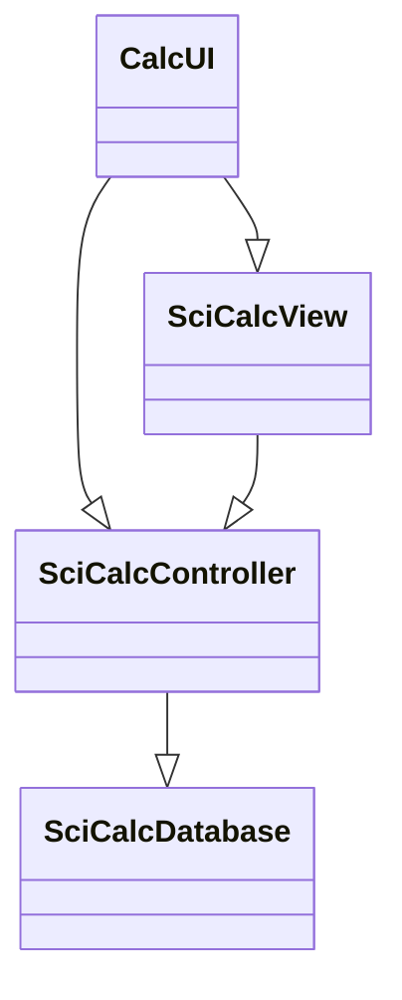
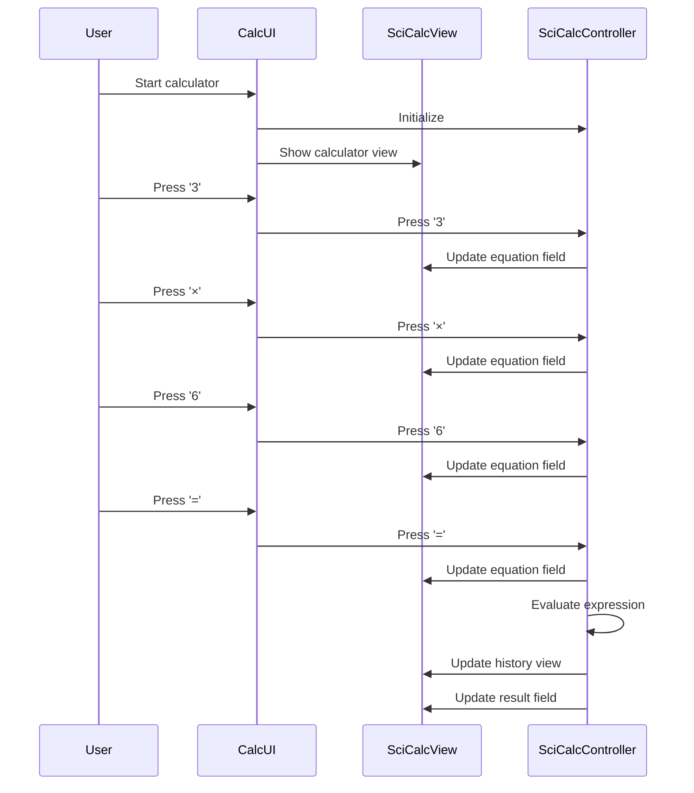

# Arkkitehtuurikuvaus

## Luokkakaavio

Alustava luokkakaavio:

```mermaid
classDiagram
    class CalcUI
    class SciCalcView
    class SciCalcController
    class SciCalcDatabase

    CalcUI --|> SciCalcView
    CalcUI --|> SciCalcController
    SciCalcView --|> SciCalcController
    SciCalcController --|> SciCalcDatabase
```

## Toimintalogiikka

Kuvataan esimerkiksi laskutoimituksen '3*6' suoritus sekvenssikaavion avulla:

```mermaid
sequenceDiagram
    participant User
    participant UI as CalcUI
    participant View as SciCalcView
    participant Controller as SciCalcController
    User->>UI: Start calculator
    UI->>Controller: Initialize
    UI->>View: Show calculator view
    User->>UI: Press '3'
    UI->>Controller: Press '3'
    Controller->>View: Update equation field
    User->>UI: Press '×'
    UI->>Controller: Press '×'
    Controller->>View: Update equation field
    User->>UI: Press '6'
    UI->>Controller: Press '6'
    Controller->>View: Update equation field
    User->>UI: Press '='
    UI->>Controller: Press '='
    Controller->>View: Update equation field
    Controller->>Controller: Evaluate expression
    Controller->>View: Update history view
    Controller->>View: Update result field
```
