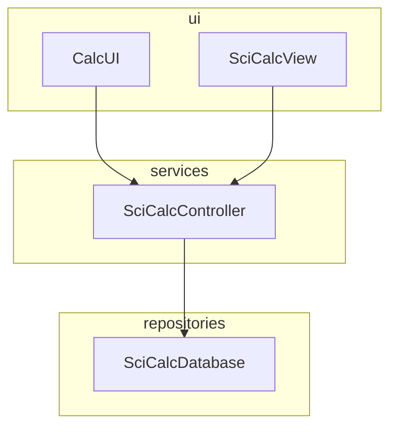
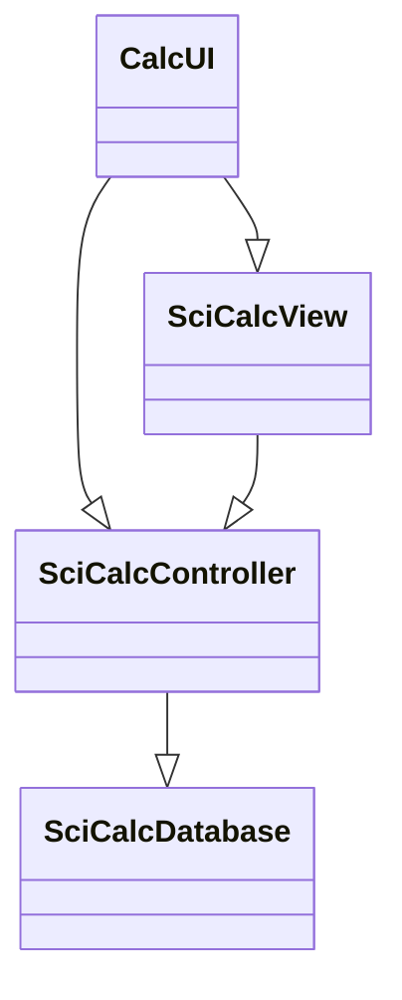
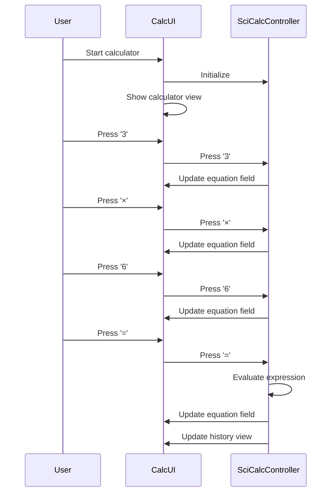
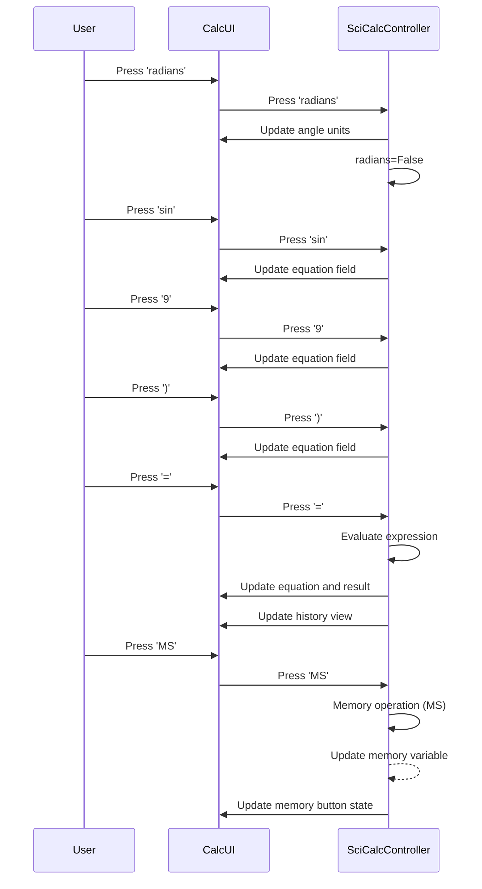
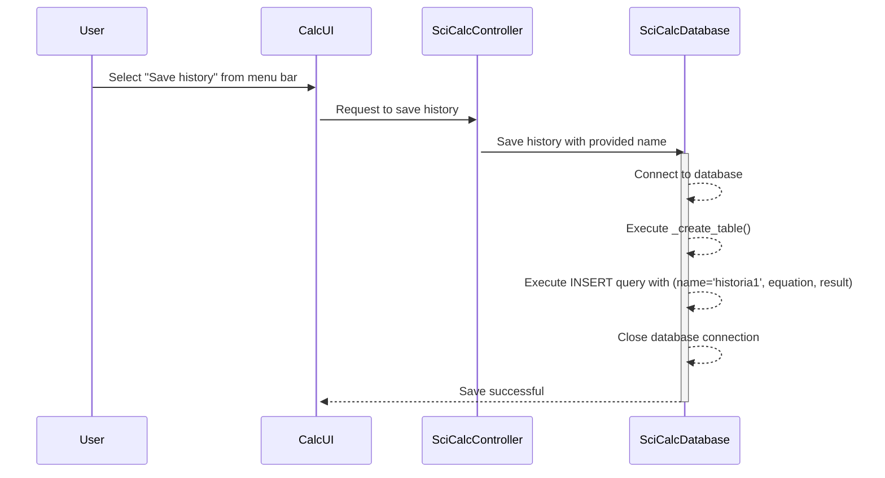

# Arkkitehtuurikuvaus

## Rakenne

Ohjelman rakenne noudattaa kolmitasoista kerrosarkkitehtuuria ja sen pakkausrakenne on seuraava:

Ohjelma koostuu neljästä luokasta: 'CalcUI', 'SciCalcView', 'SciCalcController' ja 'SciCalcDatabase':
- CalcUI vastaa laskimen käyttöliittymästä, joka koostuu laskimen näkymästä ja kontrollerista.
- SciCalcView vastaa laskimen käyttöliittymän näyttämisestä ja päivittämisestä.
- SciCalcController vastaa ohjelman sovelluslogiikasta eli se ohjaa toimintaa ja vuorovaikustusta.
- SciCalcDatabase vastaa laskimen tietokannasta, johon voi tallentaa ja lukea laskimen laskuhistoriaa.

Ohjelman luokkakaavio on esitetty sseuraavassa:

## Käyttöliittymä

Käyttöliittymä sisältää näkymän funktiolaskimesta ([SciCalcView](../src/ui/scicalc_view.py)). 
Näkymän näyttämisestä vastaa [CalcUI](../src/ui/ui.py)-luokka. Jos funktiolaskinta on tarve laajentaa 
esim. tilastotieteelliseksi laskimeksi, näkymiä on helppo lisätä sovellukseen omina luokkinaan.

## Sovelluslogiikka

Funktiolaskimen toiminnallisuudesta vastaa [SciCalcController](../src/services/controller.py)-luokka. 
Se käsittelee vuorovaikutusta käyttäjän kanssa, laskutoimitusten suoritusta, laskuhistorian seurantaa 
ja vuorovaikutusta tietokannan [SciCalcDatabase](../src/repositories/scicalc_db.py) kanssa historian 
tallentamiseksi. Seuraavassa esitellään osa kontrolleriluokan metodeista.

Käyttäjän nappien painalluksista vastaa metodi:

- `press(self, button_text)`

Laskutoimituksille on omat metodinsa, näitä ovat esimerkiksi: 

- `_basic_operations`
- `_trigonometry`
- `_roots`
- `_exponents`

Virheiden käsittely ja viestinäytöt:

- `_handle_error(self, error_message)`
- `show_message(self, message)`

Laskutoimitusten suoritus:

- `evaluate(self)`
- `_safe_eval(self, equation)`

Undo/redo ja muistitoiminnot:

- `_undo_redo(self, action)`
- `_memory(self, button_text)`

Historiatietokannan käsittely:

- `load_history_from_db(self, name)`
- `history_db_save(self)`
- `history_db_load(self)`
- `history_db_clear(self)`

## Laskuhistorian tallentaminen

Luokka [SciCalcDatabase](../src/repositories/scicalc_db.py) huolehtii laskuhistorian tallentamisesta 
SQLite-tietokantaan. Käyttäjä voi tallentaa laskuhistorian antamalla sille nimen. Historia tallennetaan 
SQLite-tietokannan tauluun `Equations`, joka sisältää kentät `name`, `equation` ja `result`. Tietokanta 
luodaan automaattisesti laskuhistoriaa ensimmäistä kertaa tallennettaessa. Käyttäjä voi myös ladata 
laskuhistorian tietokannasta sekä tarvittaessa poistaa kaikki tietokantaan tallennetut tiedot.

## Sovelluksen toiminta

Seuraavaksi kuvataan sovelluksen toimintalogiikka sekvenssikaavioiden avulla muutaman päätoiminnallisuuden osalta.

### Laskutoimituksen suorittaminen

Käyttäjä käynnistää laskimen ja syöttää laskutoimituksen `3 * 6` hiirellä ja painaa sen jälkeen `=`-nappia. 
Kuvataan ohjelman suoritus sekvenssikaavion avulla seuraavassa:

Käyttäjä vaihtaa toimintamoodiksi `degrees`, syöttää `sin(9)`, painaa `=` ja tallentaa 
lopuksi tuloksen laskimen muistiin painamalla `MS`:

### Laskuhistorian tallentaminen

Käyttäjä tallentaa laskuhistorian tietokantaan:

