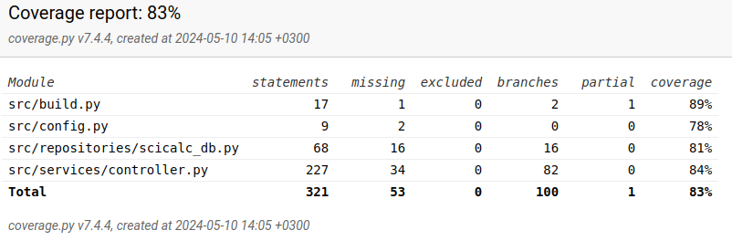

# Testausdokumentti

Ohjelmaa on testattu sekä automatisoiduin testein unittestilla sekä manuaalisesti tapahtunein järjestelmätason testein.

## Unittestit

### Sovelluslogiikka

Sovelluslogiikasta vastaava `SciCalcController`-luokka testataan TestSciCalcController-testiluokalla. Testiluokan alustuksessa 
luodaan `CalcUI`-luokan ilmentymä ja käynnistetään käyttöliittymä. Testit tarkistavat laskimen kontrollerin eri toiminnallisuuksia. 
Suurimmalle osalle metodeista on kirjoitettu testit - lähinnä `SciCalcDatabase`-luokan kanssa keskustelevat metodit jäävät testien ulkopuolelle.

### Repositorio-luokka

Repositorio-luokka `SciCalcDatabase`-luokka testataan TestSciCalcDatabase-testiluokalla. Testiluokassa alustetaan SQLite-tietokanta in-memory -tilassa eli tietokanta on vain väliaikainen ja asetetaan jokaisen testin alussa. Testien alustuksessa luodaan `SciCalcDatabase`-instanssi ja kytketään se tietokantaan. Testiluokassa testataan `SciCalcDatabase`-luokan toimintaa eri skenaarioissa. Testien ulkopuolelle jäävät lähinnä poikkeuksia aiheuttavat tilanteet.

### Testauskattavuus

Käyttöliittymäkerrosta lukuunottamatta sovelluksen testauksen haarautumakattavuus on 86%. Testaamatta jää muutama `SciCalcDatabase`-luokan kanssa yhteydessä oleva metodi `SciCalcController`-luokasta sekä `SciCalcDatabase`-luokan muutamat poikkeuksia aiheuttavat tilanteet.

## Järjestelmätestaus

Sovelluksen järjestelmätestaus on suoritettu manuaalisesti.

### Asennus ja konfigurointi

Sovellus on testattu [käyttöohjeen](./kayttoohje.md) kuvaamalla tavalla sekä Windows- että Linux-ympäristössä. Testauksessa on käytetty myös eri konfiguraatioita _.env_-tiedoston kautta.

Sovellusta on testattu tilanteessa, jossa tietokantatiedosto on ollut valmiiksi olemassa sekä tilanteessa, jossa tietokantaa ei ole alustettu. Vaikka tietokannan alustus olisi jäänyt tekemättä, ohjelma luo tietokannan siinä tapauksessa itse.

### Toiminnallisuudet

Kaikki [määrittelydokumentin](./vaatimusmaarittely.md) ja käyttöohjeen listaamat toiminnallisuudet on käyty läpi. Toiminnallisuuksien yhteydessä on syötekenttiin yritetty syöttää kuviteltavissa olevia virhetilanteita aiheuttavia syötteitä.

## Sovellukseen jääneet laatuongelmat

Kun käyttäjä on valinnut kulma-asteet käyttöön ja laskee trigonometrisia funktioita, syötekenttään lisättävät ylimääräiset aste/radiaanimuunnokset eivät ole kovin käyttäjäystävällisiä. Käyttäjä joutuu mm. sulkemaan funktion kahdella sululla.