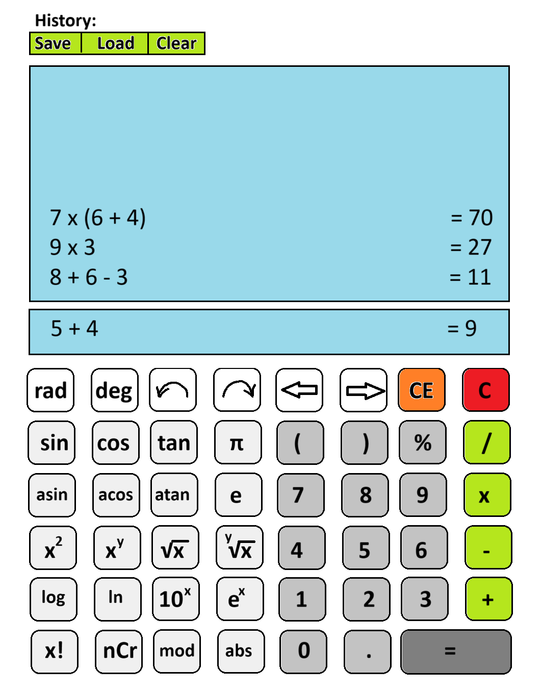
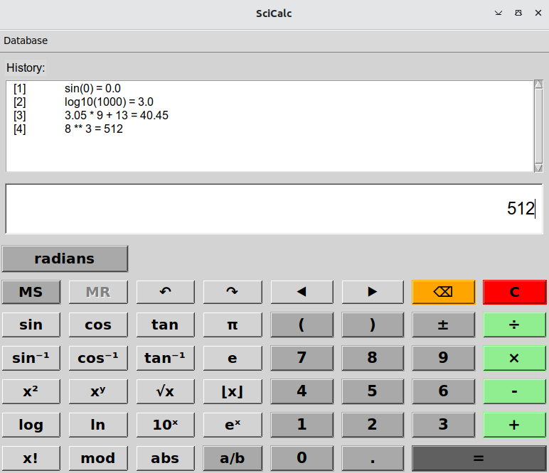

# Vaatimusmäärittely

## Sovelluksen tarkoitus

Sovellus on funktiolaskin, joka tarjoaa peruslaskutoimitusten +, -, * ja / lisäksi myös mm. trigonometriset funktiot, logaritmit, potenssilaskut ja juuret. 

## Käyttäjät

Sovellukseen ei tarvitse kirjautua, kaikki sovelluksen käyttäjät ovat normaaleita käyttäjiä.

## Käyttöliittymäluonnos

Sovellus tarjoaa seuraavantyyppisen näkymän laskutoimitusten suorittamiseen

## Valmis käyttöliittymä

Sovelluksen toteutettu käyttöliittymä on seuraava:

## Sovelluksen tarjoama toiminnallisuus

- Käyttäjä voi syöttää laskutoimitukset graafisessa käyttöliittymässä hiirellä - tehty
- Peruslaskutoimitukset (/, *, -, +) - tehty
- Funktiolaskut (trigonometria, logaritmit, potenssit...) - tehty
- Peruslaskutoimitukset onnistuvat myös näppäimistöllä ilman hiirtä - tehty
- Käyttäjä voi peruuttaa laskutoimituksissa taaksepän ja siirtyä eteenpäin - tehty
- Käyttäjä voi valita lasketaanko trigonometriset funktiot radiaaneina vai asteina - tehty
- Suoritetut laskut kertyvät yläosassa olevalle näyttöalueelle - tehty
- Laskutoimitushistorian voi tallentaa tietokantaan ja ladata sieltä - tehty
- Laskutoimitushistorioita voi poistaa tietokannasta - tehty
- Käyttäjä voi muuntaa lasketun tuloksen murtoluvuksi - tehty

## Jatkokehitysideoita

Laskimeen voisi lisätä esim. seuraavia toiminnallisuuksia:: 
- murtoluvuilla laskeminen
- tilastotiede
- kompleksiluvut
- matriisit
