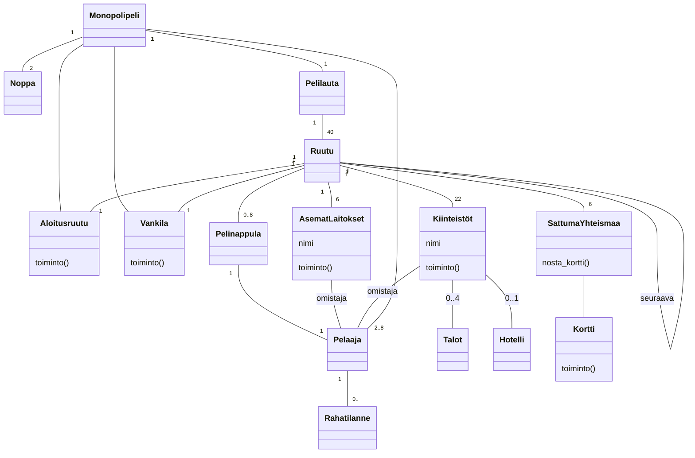

# Tehtävä 1: Monopoli-pelin luokkakaavio

```mermaid
classDiagram
    Monopolipeli "1" -- "2" Noppa
    Monopolipeli "1" -- "1" Pelilauta
    Monopolipeli -- Aloitusruutu
    Monopolipeli -- Vankila
    Pelilauta "1" -- "40" Ruutu
    Ruutu "1" -- "1" Ruutu : seuraava
    Ruutu "1" -- "0..8" Pelinappula
    Ruutu "1" -- "1" Aloitusruutu
    Ruutu "1" -- "1" Vankila
    Ruutu "1" -- "6" SattumaYhteismaa
    Ruutu "1" -- "6" AsematLaitokset
    Ruutu "1" -- "22" Kiinteistöt
    Pelinappula "1" -- "1" Pelaaja
    Pelaaja "2..8" -- "1" Monopolipeli
    Pelaaja "1" -- "0.." Rahatilanne
    Kiinteistöt : nimi
    Kiinteistöt : toiminto()
    Kiinteistöt -- Talot : 0..4
    Kiinteistöt -- Hotelli : 0..1
    AsematLaitokset : nimi
    AsematLaitokset : toiminto()
    Aloitusruutu : toiminto()
    Vankila : toiminto()
    SattumaYhteismaa -- Kortti
    SattumaYhteismaa : nosta_kortti()
    Kortti : toiminto()
    AsematLaitokset -- Pelaaja : omistaja
    Kiinteistöt -- Pelaaja : omistaja
```